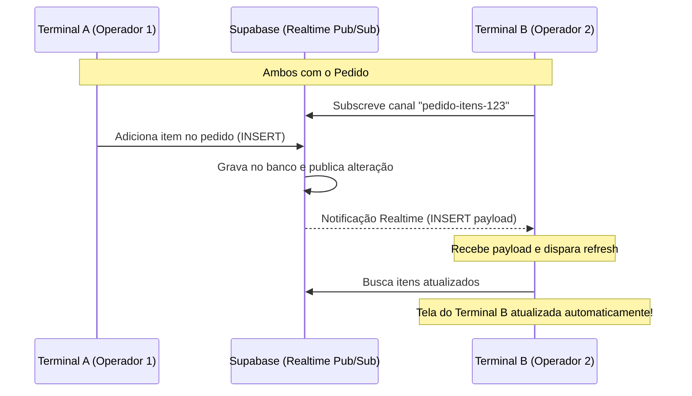
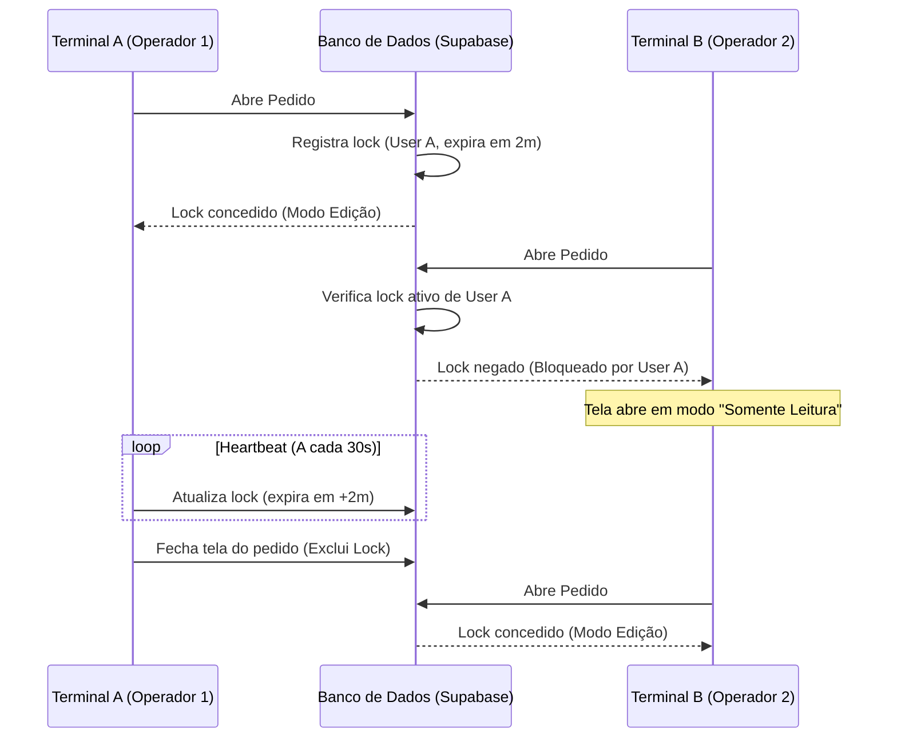

# Proposta Técnica: Sincronização e Concorrência de Pedidos

Este documento apresenta três estratégias arquiteturais para resolver o problema de concorrência quando múltiplos terminais ou abas tentam abrir e editar o mesmo pedido simultaneamente.

---

## Cenário do Problema
1. O **Terminal A** abre o Pedido #123 e lança **2 itens**.
2. O **Terminal B** abre o mesmo Pedido #123 e lança **1 item**.
3. **Consequência sem tratamento:** O estado local de cada terminal fica inconsistente, podendo gerar sobrescrita de dados, perda de itens lançados ou erros fiscais na emissão de documentos (NFe/MDFe).

---

## Estratégias Propostas

### Estratégia 1: Sincronização em Tempo Real (Supabase Realtime)
**Foco:** Fluidez de Experiência do Usuário (UX) e Colaboração.

Nesta abordagem, as alterações feitas por qualquer terminal são propagadas instantaneamente para todas as outras telas abertas na mesma rota do pedido usando o protocolo WebSocket nativo do Supabase.

#### Fluxo de Comunicação:


#### Detalhes de Implementação:
1. **Habilitar Realtime nas tabelas:**
   ```sql
   alter publication supabase_realtime add table pedido_itens;
   ```
2. **Subscrição no Frontend (React):**
   ```typescript
   import { useEffect } from 'react';
   import { supabase } from '@/lib/supabase';

   export function usePedidoRealtime(pedidoId: string, onUpdate: () => void) {
     useEffect(() => {
       const channel = supabase
         .channel(`pedido-itens-${pedidoId}`)
         .on(
           'postgres_changes',
           {
             event: '*',
             schema: 'public',
             table: 'pedido_itens',
             filter: `pedido_id=eq.${pedidoId}`
           },
           () => {
             onUpdate(); // Recarrega os itens na tela
           }
         )
         .subscribe();

       return () => {
         supabase.removeChannel(channel);
       };
     }, [pedidoId, onUpdate]);
   }
   ```

---

### Estratégia 2: Bloqueio Exclusivo de Pedido (Pessimistic Locking por Sessão)
**Foco:** Rigidez e Prevenção Total de Erros.

Impede fisicamente que dois terminais tenham o mesmo pedido aberto em modo de edição simultaneamente. Quem abrir primeiro bloqueia o pedido; acessos subsequentes entram em modo "Somente Leitura".

#### Fluxo de Comunicação:


#### Detalhes de Implementação:
1. **Estrutura de Tabela de Locks:**
   ```sql
   create table pedido_locks (
     pedido_id uuid primary key references pedidos(id) on delete cascade,
     usuario_id uuid references auth.users(id),
     locked_at timestamp with time zone default timezone('utc'::text, now()),
     expires_at timestamp with time zone not null
   );
   ```
2. **Função no Banco (PL/pgSQL) para adquirir Lock de forma segura (Thread-Safe):**
   ```sql
   create or replace function acquire_pedido_lock(p_pedido_id uuid, p_usuario_id uuid, p_duration_minutes int)
   returns boolean as $$
   declare
     v_now timestamp with time zone := now();
     v_lock_exists boolean;
   begin
     -- Remove locks expirados
     delete from pedido_locks where expires_at < v_now;

     -- Tenta inserir o lock
     insert into pedido_locks (pedido_id, usuario_id, expires_at)
     values (p_pedido_id, p_usuario_id, v_now + (p_duration_minutes || ' minutes')::interval)
     on conflict (pedido_id) do update
     set expires_at = v_now + (p_duration_minutes || ' minutes')::interval
     where pedido_locks.usuario_id = p_usuario_id
     returning true into v_lock_exists;

     return coalesce(v_lock_exists, false);
   exception
     when unique_violation then
       return false; -- Lock ocupado por outro usuário
   end;
   $$ language plpgsql security definer;
   ```

---

### Estratégia 3: Controle de Concorrência Otimista (Optimistic Locking)
**Foco:** Integridade e Detecção de Conflitos no Salvamento.

Permite que ambos os terminais operem. No entanto, o banco de dados valida se os dados foram alterados no intervalo entre o carregamento e a gravação. Se houver divergência de versão, a transação é rejeitada com segurança.

#### Detalhes de Implementação:
1. **Adicionar versão na tabela `pedidos`:**
   ```sql
   alter table pedidos add column version int default 1;
   ```
2. **Ao salvar qualquer item ou cabeçalho:**
   A query do backend verifica se a versão carregada no frontend coincide com a versão atual no banco:
   ```sql
   -- Exemplo de query que falhará se a versão mudar de 5 para 6
   update pedidos 
   set status = 'faturado', version = version + 1 
   where id = :pedido_id and version = :versao_carregada_no_frontend;
   ```
3. Se o retorno indicar `0` linhas afetadas, o frontend avisa o operador: *"Este pedido foi modificado por outro terminal. Seus dados foram atualizados. Por favor, revise antes de salvar novamente."*

---

## Matriz de Decisão para Gerência de TI

| Critério | Estratégia 1: Realtime | Estratégia 2: Bloqueio (Pessimistic) | Estratégia 3: Otimista (Optimistic) |
| :--- | :--- | :--- | :--- |
| **Experiência do Usuário (UX)** | ⭐⭐⭐⭐⭐ (Excelente, fluida) | ⭐⭐⭐ (Restritiva, bloqueante) | ⭐⭐⭐⭐ (Informativa) |
| **Complexidade de Código** | Média (Supabase nativo) | Alta (Heartbeat + RPC DB) | Baixa (Apenas checagem de versão) |
| **Consistência de Dados** | Alta (Se sincronia for rápida) | Altíssima (Prevenção física) | Altíssima (Detecção física) |
| **Risco de Conflitos** | Baixo | Zero | Médio (Mas tratado com erro) |
| **Custo de Servidor / Rede** | Médio (Muitas conexões WS) | Baixo | Mínimo |
| **Melhor aplicação** | Vendas rápidas em equipe | Faturamento, Emissão Fiscal, NFe | Cadastros simples de apoio |

---

## Recomendação Técnica

Para o ecossistema do **Realcommerce** (onde temos a emissão de notas fiscais e a integridade financeira do pedido como prioridade absoluta):

1. **Recomendação Principal (Segurança Máxima):** **Estratégia 2 (Bloqueio Exclusivo por Sessão)**. Como um pedido duplicado ou com itens adicionados indevidamente no momento da emissão da nota fiscal pode causar problemas com a SEFAZ ou inconsistência de estoque, garantir que apenas uma pessoa por vez altere o pedido é a solução corporativa mais segura.
2. **Alternativa Moderna:** Combinar a **Estratégia 1 (Realtime)** para sincronizar os itens na tela instantaneamente com a **Estratégia 3 (Otimista)** no backend para garantir que, caso as conexões WebSocket falhem temporariamente, o banco recuse alterações conflitantes na hora de salvar ou faturar.
